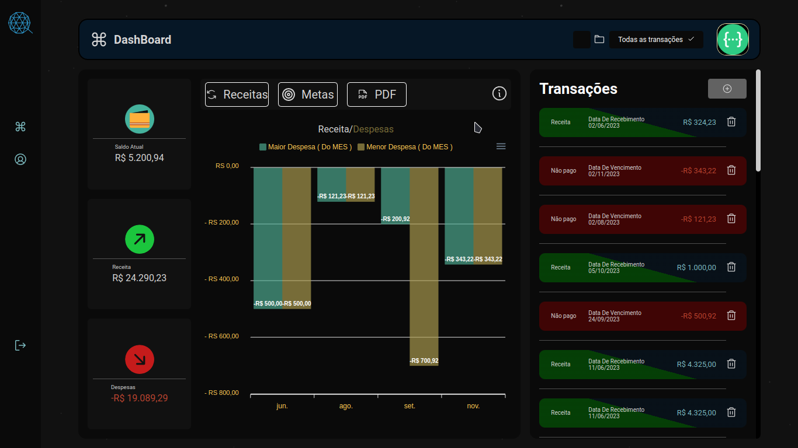
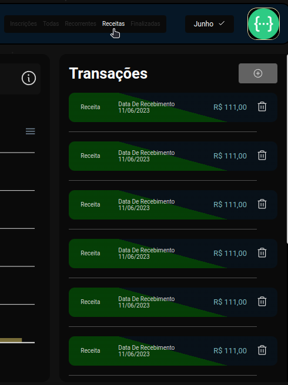
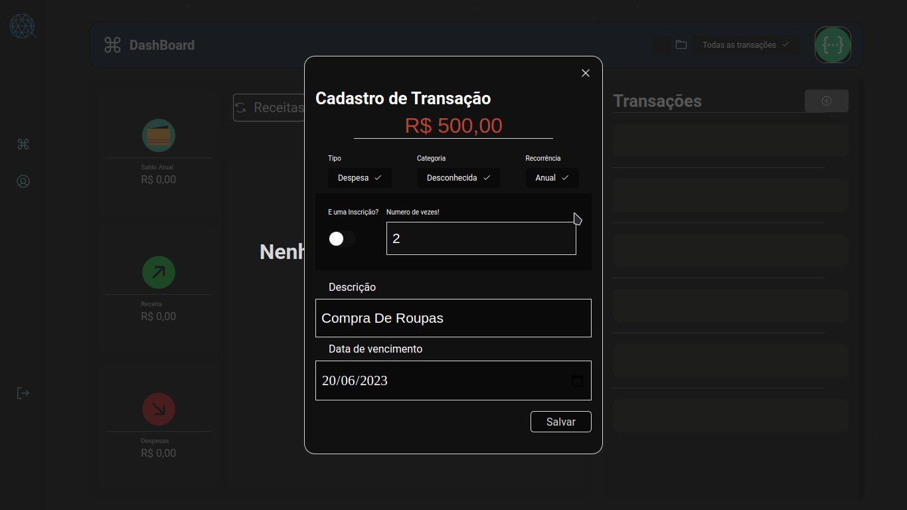
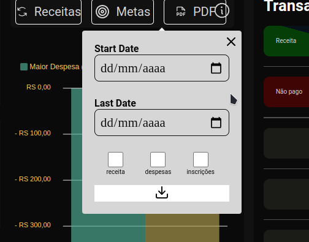
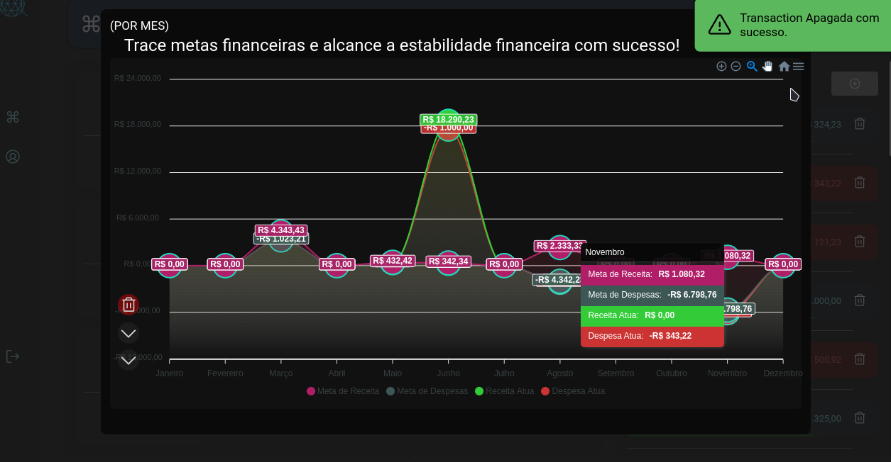
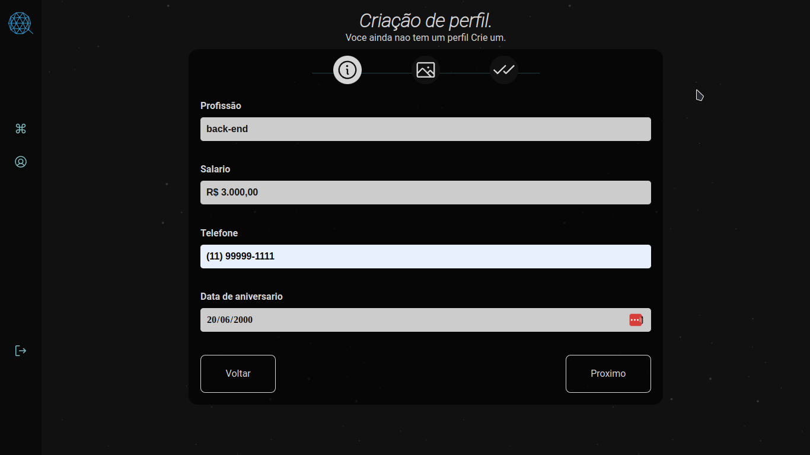

### CONTROL

OLA ME CHAMO LEANDRO E UM PROJETO QUE FIZ PARA COLOCAR NA PRATICA CONCEITOS E TECNOLOGIAS QUE EU VINHA ESTUDANDO **AINDA NAO ESTA FINALIZADO** porem queria lançar essa v1.0, GOSTO DE CRIAR COISAS DE PODE AJUDAR DE PODE REALMENTE FAZER A DIFERENÇA DE ALGUM FORMA NA VIDA DE ALGUÉM. ESTOU ESTUDANDO MAJORITARIAMENTE DESENVOLVIMENTO BACK-END QUE EU OQUE EU REALMENTE ME IDENTIFIQUEI, ME VIRO NO FRONT POREM OQUE NAO E MEU FORTE,

## TECHS QUE UTILIZEI

**FRONT-END**
// REACT // ZUSTAND // STYLED-COMPONENTS
// APEXCHARTS // RADIX-UI // DATA-FNS
// VANILA-MASKER // ZOD // REACT-HOOK-FORM
// AXIOS // ENTRE OUTRAS..

**BACK-END**
// NODEJS // EXPRESS // FIREBASE(STORAGE)
// JSON-WEB-TOKEN // JEST // PRISMA
// HANDLEBARS // HTML-PDF // NODEMAILER
// YUP // ENTRE OUTRAS..

## FUNCIONALIDADES

**PAINEL PRINCIPAL**
LISTAGEM DE TODAS AS TRANSAÇÕES PODENDO VER INFORMAÇÕES COMO POR EXEMPLO(TIPO/FINALIZAÇÃO/CATEGORIA...) E COM A OPÇÃO DE DELETAR.

FILTRAGEM POR (MES/INSCRIÇÕES/RECORRENTES/RECEITAS/FINALIZADAS)

   

CADASTRAR SUAS TRANSAÇÕES JUNTAMENTE COM A DATA DE VENCIMENTO CASO SEJA UMA DESPESA E DATA DE RECEBIMENTO CASSO SEJA RECEITA VOCE PODERÁ ADICIONA UMA CATEGORIA COM JUNTAMENTE COM UMA RECORRÊNCIA DE CADA UMA, E INFORMAR SE ELA E UMA INSCRIÇÃO.

   

UM PAINEL ONDE APARECE UM GRÁFICO COM TODOS OS MESES JUNTAMENTE COM A MAIOR E A MENOR TRANSAÇÕES CADASTRADA PARA CADA MES(DESPESA/RECEITA).

GERAR UM PDF ONDE TERA TODAS AS TRANSAÇÕES, PODENDO ESPECIFICAR UMA DATA DE INICIO E TERMINO (BASEADO NO DATA DE VENCIMENTO PARA DESPESA E DATA DE RECEBIMENTO PARA RECEITAS), FILTRA POR DISPENSAS/RECEITAS/INSCRIÇÕES

   

**SISTEMA DE METAS(OBJETIVOS)**
O USUÁRIO PODERÃO CRIAR/DELETA ESSA METAS INDIVIDUAIS PARA CADA MES, E TER UM GRÁFICO ONDE O USUÁRIO PODERÁ VER AS METAS CADASTRADAS JUNTAMENTE O VALOR ATUA DE DAS TRANSCOES JA CRIADAS

   

**SISTEMA DE PERFIL(NAO FINALIZADO)**
O USUÁRIO PODE COLOCAR ALGUNS INFORMAÇÕES ADICIONAL SOBRE ELE COMO NUMERO DE TELEFONEM,SALARIO, DATA DE ANIVERSARIO, PROFISSÃO E FOTO DE PERFIL ONDE UTILIZO O FIREBASE-STORAGE PARA GUARDAR AS IMAGES.

   

## COMO EXECUTAR O PROJETO

node: v18.14.2

**FRONT-END**
yarn para instalar todos as dependência
yarn dev

.env
url para comunicação com backend

**BACK-END**

**yarn** para instalar todos as dependência

utilizei prisma juntamente com Postgres para banco de dados
subo o docker compose **com docker-compose up -d** para
subir o banco de dados juntamente com a aplicação. Caso queria
rodar a aplicação localmente basta dar um **docker stop api** e
rodas **yarn dev**

## configuração do .env

coloque a porta
SERVER_PORT=
FORGET_EMAIL_URL=

#postgress

<!-- Configura as credenciais do banco de dados -->

DB_HOST=
DB_PORT=
DB_NAME=
DB_USER=
DB_PASS=

DATABASE_URL="postgresql://${DB_USER}:${DB_PASS}@${DB_HOST}:${DB_PORT}/${DB_NAME}?schema=public"

# nodemailer

<!-- Configura o smtp para o nodemailer vou deixar um exemplo no smtp no g-mail -->

NODEMAILER_SERVICE=gmail
NODEMAILER_HOST=smtp.gmail.com
NODEMAILER_PORT=587
NODEMAILER_USER= <!-- coloque o email da conta g-mail aqui -->
NODEMAILER_PASS= <!-- coloque a senha da conta g-mail aqui -->
